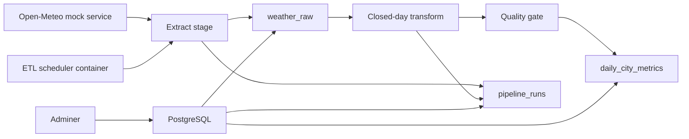

# Weather ETL Pipeline

Weather ETL Pipeline is the portfolio's DataOps and analytics-pipeline showcase.
It demonstrates how a compact ETL workload moves from "just a Python script" to a reproducible, testable, operationally explainable data platform.

## Why This Repo Exists

This project demonstrates:

- extract -> raw -> transform -> mart flow with clear ownership
- publish gating based on data-quality checks
- scheduled batch execution with audit trail
- deterministic compose-based runtime for local demo and CI
- operational evidence for recent runs, failures, and row-level outputs

## What Makes It Different

This repository is not about microservices or WebSockets.
Its niche in the portfolio is:

- batch orchestration
- DataOps discipline
- freshness and completeness thinking
- idempotent loads
- run visibility and reproducible ETL smoke

## Architecture



More detail: [docs/architecture.md](docs/architecture.md)

## Quick Demo Flow

```bash
python -m pip install -r requirements-dev.txt
python scripts/bootstrap_env.py
docker compose up -d --build
python scripts/compose_smoke.py
python scripts/collect_evidence.py
```

Local endpoints:

- PostgreSQL: `localhost:5432`
- Adminer: `http://localhost:8080`

## Runtime Layout

The compose lab contains:

- `db`: PostgreSQL for RAW, mart, and run metadata
- `etl`: scheduler container that runs one ETL cycle on startup and then continues on interval
- `open-meteo-mock`: deterministic API source for local demo and CI
- `adminer`: quick inspection UI for the database

Outside compose, the ETL can still be pointed at the real Open-Meteo API through `.env`.

## Validation

Static and unit/integration checks:

```bash
python -m ruff check .
python -m pytest -q
```

Compose/runtime validation:

```bash
docker compose config
docker compose up -d --build
python scripts/compose_smoke.py
python scripts/collect_evidence.py
```

What the compose smoke proves:

- the stack starts reproducibly
- the scheduler performs a real ETL run on startup
- RAW rows are written
- mart rows are published
- `pipeline_runs` captures run outcome and counters

Example smoke output:

```json
{
  "status": "ok",
  "run_count": 1,
  "raw_count": 2,
  "mart_count": 2
}
```

Evidence artifacts are written to `artifacts/evidence/`.

## Operator Commands

Run one more ETL cycle against the running stack:

```bash
python scripts/run_backfill.py
```

Inspect recent pipeline runs:

```bash
docker compose exec -T etl python -m app.etl.report --limit 5
```

## Data Quality Behavior

The mart is not published blindly.
The pipeline keeps closed-day semantics as a first-class rule:

- only closed days are eligible for mart publication
- incomplete daily coverage produces warnings
- critical incompleteness blocks rows from entering the mart
- each run leaves an audit record in `pipeline_runs`

## Runbook

Operational steps and troubleshooting live in [runbooks/demo.md](runbooks/demo.md)

## Portfolio Outcome

This repository now covers a clear DataOps niche in the portfolio:

- batch ETL operations
- idempotent ingest
- quality-gated publish
- reproducible compose runtime
- run visibility and evidence collection

## Known Limitations

These are deliberate scope boundaries, not current `DoD` blockers:

- no Airflow layer yet
- no MinIO raw archive yet
- no Prometheus/Grafana stack yet
- no backup/restore automation yet
- no dbt layer yet

## Explicit Non-Goals

- add `Prometheus + Grafana + Alertmanager`
- add `MinIO` for raw payload archive and artifacts
- add backup and restore scripts
- add Airflow only if orchestration complexity becomes worth it
- add `dbt` or a documented SQL contract layer for mart modeling

The current repo is complete as a compact DataOps showcase: deterministic source, raw-to-mart modeling, quality-gated publish, scheduler path, audit trail, CI, runbook, and evidence collection.
